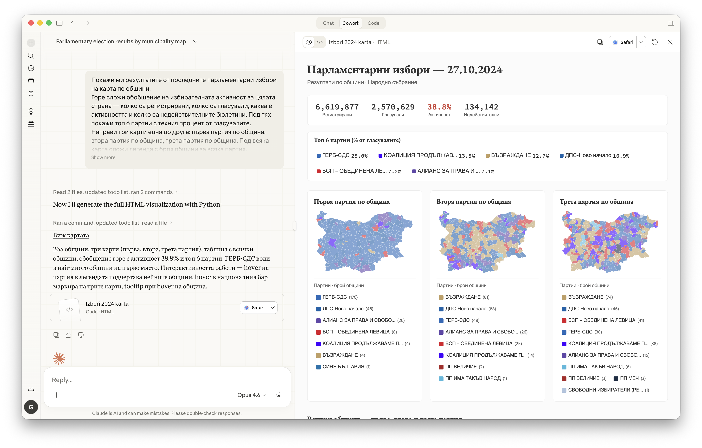

# Elections Explorer — Claude Cowork

Explore Bulgarian election data (2021–2024) interactively using Claude's Cowork mode. Ask questions in Bulgarian, get visualizations — maps, charts, comparisons — generated directly from the database.



## What you get

Five pre-built skills that teach Claude how to query `elections.db` and render interactive HTML artifacts:

| Skill | What it does |
|---|---|
| `municipality-map` | SVG map of Bulgaria colored by winning party per municipality |
| `results-chart` | Bar chart with turnout stats for any election/region |
| `risk-map` | Anomaly scatter plot — sections scored by Benford, peer deviation, ACF |
| `comparison` | Compare party results across multiple elections |
| `turnout` | Turnout breakdown by district or municipality |

Claude picks the right skill based on your question. You just ask.

## Setup

### 1. Clone this repo

```bash
git clone https://github.com/georgialexandrov/bg-elections-data.git
cd bg-elections-data/elections-explorer
```

### 2. Download the database

The database (~1.3 GB) is published as a GitHub Release asset. Download it into this directory:

```bash
# Using GitHub CLI
gh release download v0.12.1 --pattern "elections.db" --dir .

# Or manually — go to Releases, download elections.db, place it here
```

Verify it's in the right place:
```bash
ls -lh elections.db
# Should show ~1.3 GB file
```

### 3. Open in Claude Desktop (Cowork mode)

1. Open **Claude Desktop** (claude.ai desktop app)
2. Switch to **Cowork** mode (top tab bar)
3. Open this `elections-explorer/` directory as your project folder
4. Start asking questions in Bulgarian

## Example prompts

```
Покажи ми резултатите от последните парламентарни избори на карта по общини.

Сравни ГЕРБ и ДПС в последните 5 парламентарни избора.

Къде има най-висок риск от аномалии в изборите от октомври 2024?

Каква е избирателната активност по области?

Покажи топ 10 общини с най-висока активност за изборите на 09.06.2024.
```

## How it works

- `CLAUDE.md` defines the database schema, query rules, and routing logic
- `skills/` contains visualization templates — each one is a recipe for a specific chart/map type
- Claude reads the skill, writes a SQL query, runs it, and generates an interactive HTML artifact
- All visualizations use Bulgarian labels, consistent branding (EB Garamond + Hind fonts), and interactive hover effects

## Requirements

- [Claude Desktop](https://claude.ai/download) with Cowork mode
- ~1.5 GB disk space for the database
- No other dependencies — everything runs through Claude's built-in tools

## Available elections

| ID | Election | Date | Type |
|---|---|---|---|
| 1 | Народно събрание | 27.10.2024 | parliament |
| 3 | Народно събрание | 09.06.2024 | parliament |
| 4 | Европейски парламент | 09.06.2024 | european |
| 5 | Общински съветници | 29.10.2023 | local_council |
| 12 | Народно събрание | 02.04.2023 | parliament |
| 13 | Народно събрание | 02.10.2022 | parliament |
| 14 | Народно събрание | 14.11.2021 | parliament |
| 17 | Народно събрание | 11.07.2021 | parliament |
| 18 | Народно събрание | 04.04.2021 | parliament |

By default Claude uses **ID 1** (the most recent parliamentary election, 27.10.2024).

## Data source

All data is from the Bulgarian Central Election Commission (CIK). National election totals are validated to match CIK's official per-party results exactly. See the main project [README](../README.md) for details.
