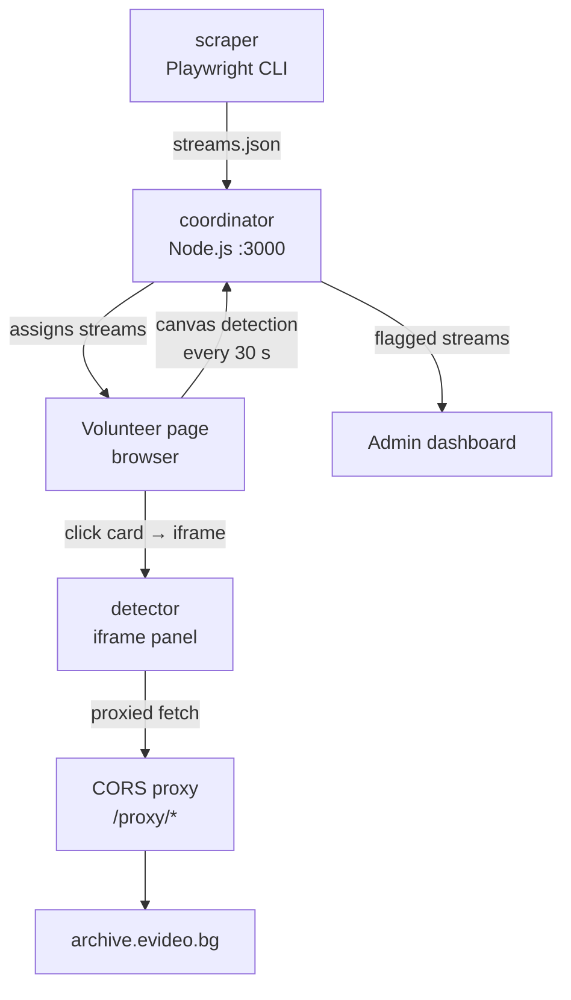

# monitor-the-vote

Crowdsourced integrity-monitoring system for Bulgarian election video streams from [evideo.bg](https://evideo.bg). Built at the **Data Science Society Bulgaria Hackathon — 28 March 2026**.

Volunteers open a browser tab and silently watch multiple polling-station streams in parallel. A backend aggregates their reports and surfaces anomalies on an admin dashboard. A standalone deep-inspection tool lets operators examine any single stream for freeze, black-frame, or camera-cover events.

## Architecture

```text
apps/
  coordinator/   Node.js API server + volunteer page + admin dashboard
  scraper/       Playwright CLI — extracts stream URLs from evideo.bg
  detector/      Standalone single-stream freeze/cover detector
```




## How it works

1. **Scrape** — the scraper visits an evideo.bg election index page (handling Cloudflare JS challenges via a real Chromium browser) and outputs a JSON list of stream URLs.
2. **Distribute** — the coordinator assigns streams to volunteers in round-robin fashion. Each volunteer tab silently loads multiple video streams and runs canvas pixel analysis every 30 s to detect:
   - **Freeze** — frame has not changed for 120 s
   - **No signal** — average frame luminance below threshold (black frame / camera off)
   - **Camera cover** — majority of 16×9 grid cells show near-zero local variance for 30 s (lens blocked)
3. **Report** — volunteers POST detection results to the coordinator every 30 s. The server aggregates reports; streams flagged by ≥2 volunteers in the last 5 minutes surface in the admin view.
4. **Inspect** — clicking any card in the volunteer page loads the standalone detector in the right-side iframe panel at the exact stream and video timestamp, showing frame-accurate wall-clock recording time extracted from the filename.

## Local development

### One-time setup

```sh
pnpm install
pnpm --filter scraper exec playwright install chromium
```

### Start everything

```sh
pnpm dev      # coordinator on :3000, with --watch hot-reload
pnpm seed     # load both pre-scraped sample files (le20260222 + le20250615)
```

All three UIs are served from the same origin — no extra processes:

| URL | Description |
| --- | ----------- |
| `http://localhost:3000` | Volunteer monitoring page |
| `http://localhost:3000/admin` | Admin dashboard |
| `http://localhost:3000/inspect` | Single-stream freeze/cover detector |

`pnpm dev` uses `node --watch` (Node 22 built-in), so the server restarts automatically on any file change. No nodemon required.

The detector's CORS proxy is the coordinator's own `/proxy/*` route — no separate proxy process needed.

### Seed options

```sh
pnpm seed                                                      # upsert both sample files (additive, default)
pnpm seed apps/scraper/streams_le20260222_tour1_live.json      # load one file
pnpm seed apps/scraper/streams_le20250615_tour1_live.json      # load other file
node scripts/seed.js apps/scraper/streams.json                 # any custom file
node scripts/seed.js --replace                                 # destructive: wipe & replace all
node scripts/seed.js --force                                   # destructive + skip confirmation
PORT=4000 node scripts/seed.js                                 # custom port
```

The default mode uses `POST /api/streams/upsert` — sections are matched by their 9-digit ID. New sections are added; existing sections get their URL updated (e.g. after a device restart) and `last_checked` reset so volunteers pick them up immediately. Sessions and reports are preserved.

### Scrape fresh streams

```sh
pnpm scrape https://evideo.bg/le20260222/index.html > apps/scraper/streams.json
pnpm seed apps/scraper/streams.json
```

The scraper outputs `{section, url, label}` objects. The `section` field (9-digit polling station ID) is the unique key. During a live 2–3h monitoring window, you can scrape and seed incrementally to ramp up coverage:

```sh
# Add first batch of priority sections
pnpm seed apps/scraper/priority.json

# Later, add more sections — existing ones are skipped or updated
pnpm seed apps/scraper/full.json
```

## Authentication & User Management

The coordinator uses a SQLite-backed user store with bcrypt-hashed passwords. There are two roles: `admin` (full access) and `volunteer` (monitoring only).

### First-time setup

On first startup with an empty database, the coordinator creates a seed admin account from environment variables:

```sh
ADMIN_USER=myadmin ADMIN_PASS=mysecretpass pnpm dev
```

After the first admin is created, these env vars are no longer required — the system authenticates entirely against the database.

### Adding users from the admin panel

Log in at `/admin` and scroll to the "User Management" section. From there you can:

- Add a single user with username, password (min 8 chars), and role
- Bulk-import users by pasting or uploading a JSON file
- View all users and delete accounts (you can't delete your own)

### Bulk import format

Prepare a JSON array — one object per user:

```json
[
  { "username": "vol1", "password": "pass1234", "role": "volunteer" },
  { "username": "vol2", "password": "securepass", "role": "volunteer" },
  { "username": "admin2", "password": "adminpass1", "role": "admin" }
]
```

Upload it via the admin panel's "Bulk Upload Users" area, or POST directly:

```sh
curl -b session=<admin-cookie> \
  -H 'Content-Type: application/json' \
  -d @users.json \
  http://localhost:3000/api/users/bulk
```

Duplicates are skipped (not rejected). The response tells you how many were created and which were skipped.

### User management API

All endpoints require an admin session cookie.

| Method | Endpoint | Description |
| ------ | -------- | ----------- |
| `POST` | `/api/users` | Add a single user (`{ username, password, role }`) |
| `POST` | `/api/users/bulk` | Bulk-add users (JSON array) |
| `GET` | `/api/users` | List all users (username + role, no passwords) |
| `DELETE` | `/api/users/:username` | Remove a user |

## Root scripts

| Command | Description |
| ------- | ----------- |
| `pnpm dev` | Start coordinator with hot-reload (`node --watch`) |
| `pnpm start` | Start coordinator (production, no watch) |
| `pnpm seed` | Load sample streams into the running coordinator |
| `pnpm test` | Run Playwright tests for the coordinator |
| `pnpm scrape <url>` | Scrape stream URLs from an evideo.bg index page |

## Requirements

- Node.js 22+ (uses `node:sqlite` and `node --watch` built-ins)
- pnpm 9+
- Playwright browsers (scraper only): `pnpm --filter scraper exec playwright install chromium`
