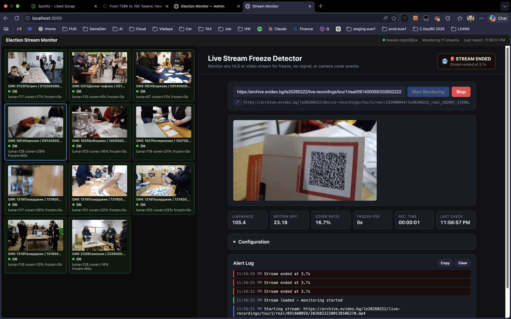
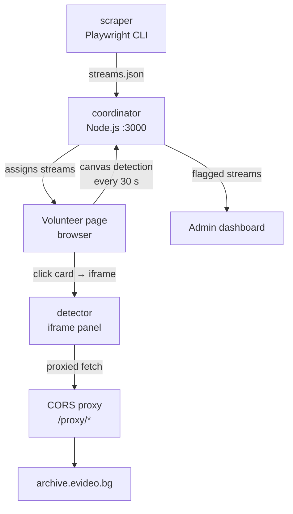

# monitor-the-vote

Crowdsourced integrity-monitoring system for Bulgarian election video streams from [evideo.bg](https://evideo.bg). Built at the **Data Science Society Bulgaria Hackathon — 28 March 2026**.

Volunteers open a browser tab and silently watch multiple polling-station streams in parallel. A backend aggregates their reports and surfaces anomalies on an admin dashboard. A standalone deep-inspection tool lets operators examine any single stream for freeze, black-frame, or camera-cover events.

## Architecture

```text
apps/
  coordinator/   Node.js API server + volunteer page + admin dashboard
  scraper/       Playwright CLI — extracts stream URLs from evideo.bg
  detector/      Standalone single-stream freeze/cover detector
```






## How it works

1. **Scrape** — the scraper visits an evideo.bg election index page (handling Cloudflare JS challenges via a real Chromium browser) and outputs a JSON list of stream URLs.
2. **Distribute** — the coordinator assigns streams to volunteers in round-robin fashion. Each volunteer tab silently loads multiple video streams and runs canvas pixel analysis every 30 s to detect:
   - **Freeze** — frame has not changed for 120 s
   - **No signal** — average frame luminance below threshold (black frame / camera off)
   - **Camera cover** — majority of 16×9 grid cells show near-zero local variance for 30 s (lens blocked)
3. **Report** — volunteers POST detection results to the coordinator every 30 s. The server aggregates reports; streams flagged by ≥2 volunteers in the last 5 minutes surface in the admin view.
4. **Inspect** — clicking any card in the volunteer page loads the standalone detector in the right-side iframe panel at the exact stream and video timestamp, showing frame-accurate wall-clock recording time extracted from the filename.

## Local development

### One-time setup

```sh
pnpm install
pnpm --filter scraper exec playwright install chromium
```

### Start everything

```sh
pnpm dev      # coordinator on :3000, with --watch hot-reload
pnpm seed     # load the pre-scraped sample streams (requires server running)
```

All three UIs are served from the same origin — no extra processes:

| URL | Description |
| --- | ----------- |
| `http://localhost:3000` | Volunteer monitoring page |
| `http://localhost:3000/admin` | Admin dashboard |
| `http://localhost:3000/inspect` | Single-stream freeze/cover detector |

`pnpm dev` uses `node --watch` (Node 22 built-in), so the server restarts automatically on any file change. No nodemon required.

The detector's CORS proxy is the coordinator's own `/proxy/*` route — no separate proxy process needed.

### Seed options

```sh
pnpm seed                                          # default: apps/scraper/streams_tour1_live.json
node scripts/seed.js apps/scraper/streams.json     # custom file
PORT=4000 node scripts/seed.js                     # custom port
```

### Scrape fresh streams

```sh
pnpm scrape https://evideo.bg/le20260222/index.html > apps/scraper/streams.json
pnpm seed apps/scraper/streams.json
```

## Root scripts

| Command | Description |
| ------- | ----------- |
| `pnpm dev` | Start coordinator with hot-reload (`node --watch`) |
| `pnpm start` | Start coordinator (production, no watch) |
| `pnpm seed` | Load sample streams into the running coordinator |
| `pnpm test` | Run Playwright tests for the coordinator |
| `pnpm scrape <url>` | Scrape stream URLs from an evideo.bg index page |

## Requirements

- Node.js 22+ (uses `node:sqlite` and `node --watch` built-ins)
- pnpm 9+
- Playwright browsers (scraper only): `pnpm --filter scraper exec playwright install chromium`
