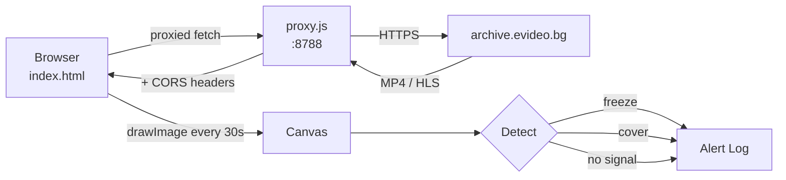

# detector

Standalone single-stream freeze and cover detector. Open `index.html` in a browser, paste an HLS stream URL, and it will alert you if the stream freezes or goes dark.

No backend required — runs entirely in the browser using canvas frame analysis.



## Usage

### Via coordinator (recommended for local dev)

When the coordinator is running, the detector is served at:

```text
http://localhost:3000/inspect
```

No extra processes needed — the coordinator's `/proxy/*` route handles CORS.

### Standalone

```sh
# Requires the CORS proxy if the stream is cross-origin
node proxy.js &          # starts on port 8788
npx serve -l 8787 .      # serves index.html on port 8787
```

Then open `http://localhost:8787`.

### Stream URL

Paste an `.mp4` or `.m3u8` URL directly, or use the proxy prefix for cross-origin streams:

```text
http://localhost:3000/proxy/le20260222/live-recordings/tour1/real/123456/stream.mp4
```

## CORS proxy (`proxy.js`)

Standalone proxy — only needed when running the detector without the coordinator.
Forwards all requests to `https://archive.evideo.bg` with permissive CORS headers.

```sh
node proxy.js
# CORS proxy: http://localhost:8788  →  https://archive.evideo.bg
```

## Detection

The page samples video frames on a canvas every second and checks for:

- **Freeze** — frame has not changed for a configurable number of seconds
- **Cover** — the majority of pixels are near-black (camera covered or lens blocked)

Alerts appear in an on-screen log and trigger a browser notification (requires permission).

## Notes

- Use the coordinator's built-in proxy at `/proxy/*` in production instead of running `proxy.js` separately.
- `poc.html` in `apps/coordinator/public/` is a simpler version of this detector used for automated Playwright tests.
